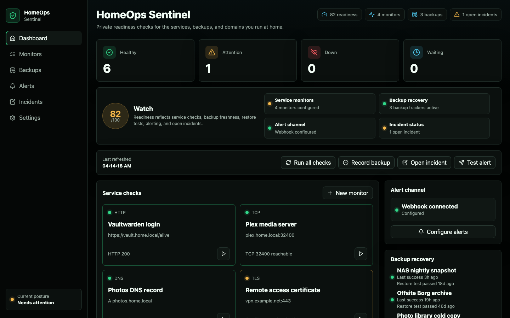
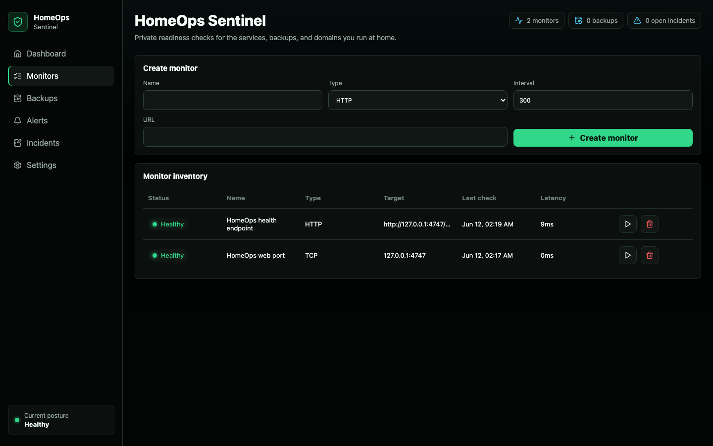
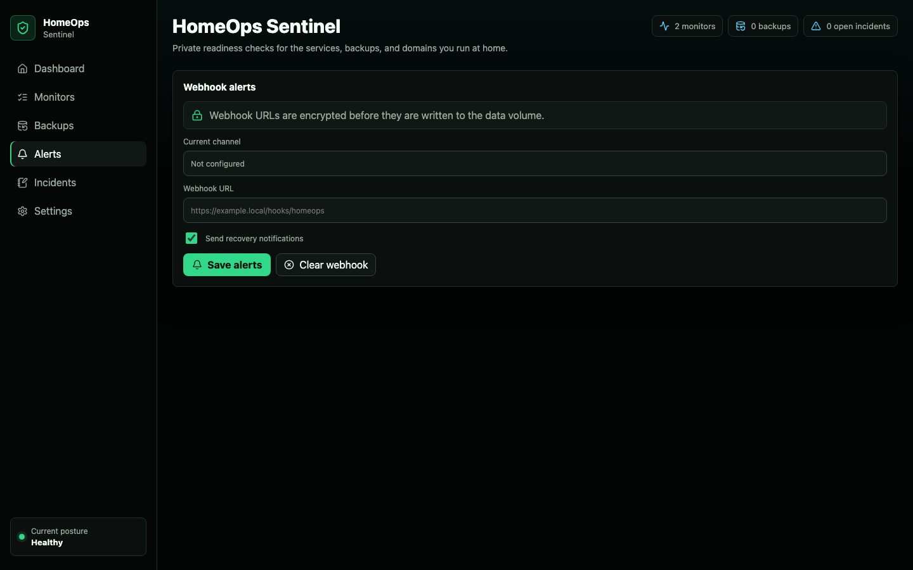

# HomeOps Sentinel

HomeOps Sentinel is an Umbrel-ready app for private home-server readiness checks. It monitors local services and domains, tracks backup freshness and restore-test proof, records incident notes, and sends webhook alerts when a monitor changes state.

<p align="center">
  
  <br>
  <sub>Populated dashboard with service checks, backup recovery proof, alert status, and incident notes.</sub>
</p>

<p align="center">
  
  
</p>

## Features

- HTTP, TCP, DNS, and TLS certificate monitors.
- Backup freshness and restore-test tracking with manual success recording or bearer-token heartbeat endpoints.
- Private incident log for outages, upgrades, and recovery notes.
- Readiness scoring across monitors, backups, alerts, and open incidents.
- Encrypted webhook alert URL storage with test delivery and recent delivery history.
- Same-origin API intent checks, safe browser security headers, and guarded webhook delivery.
- Atomic JSON persistence under `data/` for local development or `/data` in Docker.
- Container entrypoint repairs mounted data-directory ownership, then runs the server as the unprivileged `node` user.
- Umbrel app package assets under `umbrel-app-store/homeops-sentinel/`.

## Start Locally

```sh
npm install
npm run dev
```

Open `http://127.0.0.1:5173`.

The backend runs on `http://127.0.0.1:4747` and Vite proxies `/api` requests during development.

## Production Run

```sh
npm run build
npm start
```

Open `http://127.0.0.1:4747`.

## Docker Run

```sh
docker compose up --build
```

Open `http://127.0.0.1:4747`.

The included GitHub Actions workflow `.github/workflows/publish-image.yml` runs release checks with read-only default permissions and can publish a multi-architecture GHCR image for the Umbrel package through manual dispatch. The publish job is the only job with package write access, and it records the image digest plus registry SBOM/provenance evidence for release handoff.
See `docs/GITHUB_RELEASE.md` for the GitHub main release runbook.

## Verification

```sh
npm run lint
npm run typecheck
npm run test:coverage
npm run build
npm run smoke
npm run smoke:docker
npm run test:e2e
npm run test:a11y
```

For release preparation, also run:

```sh
npm run release:status
npm run check:github-release
npm run check:release
npm audit --omit=dev --audit-level=high
```

Those release checks can still block on GitHub identity, upstream, clean-tree, package Docker image digest, source/support/release URLs, and release evidence requirements. The dependency audit requires registry access.

`npm run smoke` starts the built production server on a temporary local port with a workspace-local temporary data directory, checks `/api/health`, verifies static serving, confirms cross-origin mutation protection, creates a backup heartbeat token, and confirms the token is not returned by public state.

`npm run smoke:docker` builds a temporary Docker image, runs it with a temporary named volume, verifies the app runs as the unprivileged `node` user, confirms state survives container restart, confirms secret values are encrypted or hashed in `/data/homeops-sentinel.json`, then removes the temporary container, volume, and image.

`npm run check` is the release-quality gate. It runs linting, formatting checks,
type checks, 85/80/85 coverage enforcement, production build, local smoke,
Playwright E2E, and Playwright accessibility checks.

## Configuration

| Variable | Default | Description |
| --- | --- | --- |
| `PORT` | `4747` | HTTP port used by the backend. |
| `HOST` | `127.0.0.1` | Bind host for local production runs. Docker and Umbrel set this to `0.0.0.0` inside the container network. |
| `HOMEOPS_DATA_DIR` | `./data` | Directory for persistent state and generated secret material. |
| `HOMEOPS_STATIC_DIR` | `./dist` | Directory containing the built frontend. |
| `HOMEOPS_SECRET_KEY` | generated in data dir | Optional encryption seed for local development. |
| `APP_SEED` | provided by Umbrel | Umbrel-provided seed used for encrypted webhook storage. |

## Umbrel Package

The app package lives in `umbrel-app-store/homeops-sentinel/` and includes:

- `docker-compose.yml`
- `umbrel-app.yml`
- `icon.svg`
- `exports.sh`
- `gallery/` with metadata-clean release screenshots. The initial package manifest keeps `gallery: []` and `releaseNotes: ""`.

Follow `docs/UMBREL_PACKAGE.md` before publishing a package release.
See `docs/VALIDATION_GUIDE.md` for local and Docker validation steps.
See `docs/UMBREL_TESTING.md` for the reviewer-facing Umbrel test matrix and
`docs/ARCHITECTURE.md` for the runtime architecture.

## Security Notes

HomeOps Sentinel is security-sensitive because it stores alert endpoints and probes user-defined network targets. The implementation avoids custom auth and relies on Umbrel's app proxy as the outer authentication boundary. It keeps secrets server-side, encrypts webhook URLs before writing them to disk, rejects unsupported URL schemes, blocks cloud metadata/link-local targets, rate-limits manual monitor checks, requires a same-origin intent header for browser mutations, and returns safe client errors.

Backup heartbeat tokens are generated server-side, shown once, and stored only as hashes. External backup jobs can call `POST /api/backups/:id/heartbeat` with `Authorization: Bearer <token>` to record a successful run without exposing the main app UI.

Webhook targets are revalidated before delivery and after redirects. Loopback, private/LAN, CGNAT, metadata, link-local, multicast, unspecified, credential-bearing, and unsupported-scheme webhook URLs are rejected. Local network monitor targets are intentionally allowed for home-server monitoring, but metadata and link-local targets are blocked.

## Privacy And Network Access

- Data is stored locally in the app data directory; there is no telemetry.
- Outbound network requests happen only for user-configured monitors and webhook alerts.
- Webhook URLs are encrypted at rest and only masked metadata is returned to the browser.
- Heartbeat tokens are shown once, stored only as hashes, and never returned by `/api/state`.
- `/api/diagnostics` returns app version, runtime health, scheduler status, and
  redacted counts without webhook URLs, heartbeat tokens, token hashes, or local
  filesystem paths.
- Persistent files are `homeops-sentinel.json` and `.homeops-secret` inside the configured data directory.
- The package container has no Docker socket, no privileged mode, and no host filesystem mount beyond its app data directory.

## Vulnerability Reporting

See `SECURITY.md` for supported versions, private reporting guidance, and the security-sensitive areas maintainers should test before release.

## Known Limitations

- User-facing access relies on Umbrel app proxy authentication; the app does not add separate accounts or RBAC.
- Restore-test proof is user-recorded evidence; the app tracks cadence, target, result, and notes, but it does not perform an automated restore.
- Alerting supports one webhook destination and best-effort delivery history.
- Local network monitor probing is intentionally allowed for home-server use, while metadata, link-local, multicast, and unsafe targets are blocked.
- Package release validation depends on a public multi-architecture image digest, real source/support URLs, complete release evidence, and publish-workflow SBOM/provenance proof for the final digest.

See `docs/SECURITY_THREAT_MODEL.md` for the working threat model.
